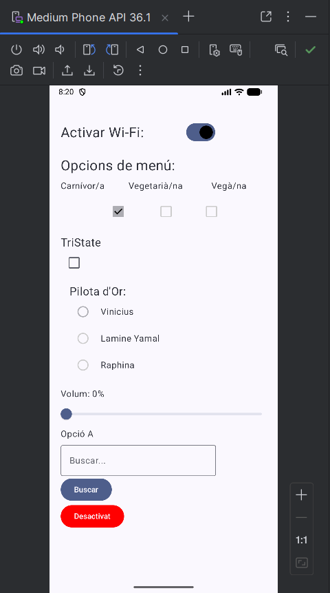
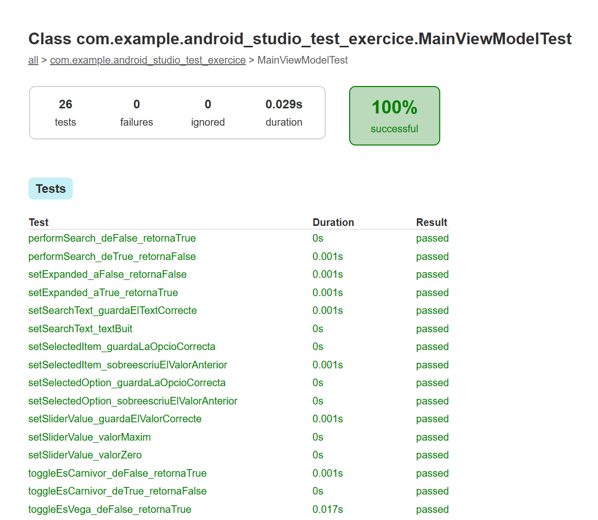
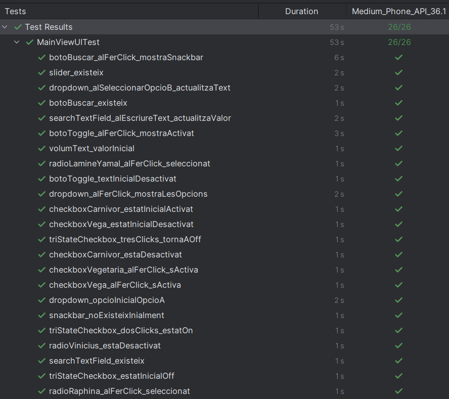

# Android Studio Test Exercice


App d'exemple desenvolupada en **Kotlin + Jetpack Compose** seguint el patró **MVVM**, amb tests unitaris (JUnit) i tests d'interfície (Compose UI Testing + Espresso).

## Demo

<video src="docs/videos/androidTesting.mkv" controls width="320"></video>

> Si el reproductor no es veu al teu navegador (GitHub no preveu inline `.mkv`), pots [descarregar el vídeo aquí](docs/videos/androidTesting.mkv).

## Captura de l'app



L'app conté els següents components Material 3:

- `Switch` — activar/desactivar Wi-Fi
- 3 `Checkbox` — Carnívor (deshabilitat), Vegetarià, Vegà
- `TriStateCheckbox` — cicle Off → Indeterminate → On → Off
- 3 `RadioButton` — Vinicius (deshabilitat), Lamine Yamal, Raphina
- `Slider` — 0–100% amb text dinàmic
- `DropdownMenu` — Opció A / B / C
- `OutlinedTextField` — camp de cerca
- `Button` "Buscar" — mostra una snackbar
- `Button` toggle — alterna entre vermell ("Desactivat") i verd ("Activat")

## Arquitectura

Patró **MVVM** amb separació clara de capes:

```
app/src/main/java/com/example/android_studio_test_exercice/
├── MainActivity.kt              # Entry point
├── view/MainView.kt             # Composable UI (View)
└── viewmodel/MainViewModel.kt   # Estat amb LiveData (ViewModel)
```

L'estat de la UI es gestiona des del [MainViewModel](app/src/main/java/com/example/android_studio_test_exercice/viewmodel/MainViewModel.kt) mitjançant `MutableLiveData` privats, exposats com a `LiveData<T>` immutables. La [MainView](app/src/main/java/com/example/android_studio_test_exercice/view/MainView.kt) els observa amb `observeAsState()` i només crida funcions del ViewModel — no manté estat propi.

## Testing

El projecte conté dues bateries de tests independents:

### Unit Tests — [MainViewModelTest](app/src/test/java/com/example/android_studio_test_exercice/MainViewModelTest.kt)

**26 tests** que validen tots els mètodes públics del `MainViewModel` sense necessitat d'emulador.

| Mètode testat | Casos coberts |
|---|---|
| `toggleEstatSwitch` | true→false, false→true |
| `toggleEsCarnivor` | true→false, false→true |
| `toggleEsVegetaria` | false→true, true→false |
| `toggleEsVega` | false→true, true→false |
| `toggleTriStateStatus` | Off→Indeterminate, Indeterminate→On, On→Off |
| `setSelectedOption` | guarda valor, sobreescriu valor anterior |
| `setSliderValue` | valor normal, 0, 100 |
| `setExpanded` | true, false |
| `setSelectedItem` | guarda valor, sobreescriu valor anterior |
| `setSearchText` | text normal, text buit |
| `performSearch` | false→true, true→false |
| `toggle` | false→true, true→false |

Tecnologies: **JUnit 4** + **InstantTaskExecutorRule** (per executar `LiveData` de manera síncrona).



Executar:

```bash
./gradlew testDebugUnitTest
```

### UI Tests — [MainViewUITest](app/src/androidTest/java/com/example/android_studio_test_exercice/MainViewUITest.kt)

**26 tests** d'instrumentació que validen la interacció real amb cada component de la UI sobre un emulador o dispositiu físic.

Cada component es testeja amb dos tipus de validació:

- **Estat inicial** — `assertIsOn`, `assertIsOff`, `assertTextEquals`, `assertExists`, `assertDoesNotExist`...
- **Post-interacció** — `performClick`, `performTextInput` i validació de l'estat resultant.

Tecnologies: **Compose UI Testing** + **Espresso 3.7.0**, amb `createAndroidComposeRule<MainActivity>()`.



Executar (cal emulador o dispositiu connectat):

```bash
./gradlew connectedDebugAndroidTest
```

> **Nota:** Espresso `3.6.1` no és compatible amb Android API ≥ 35 (`InputManager.getInstance()` ha estat eliminat). Aquest projecte usa Espresso `3.7.0` i AndroidX Test JUnit `1.3.0` per resoldre-ho.

## Tecnologies

- Kotlin 2.0
- Jetpack Compose (BOM 2024.04.01)
- Material 3
- ViewModel + LiveData
- JUnit 4 + InstantTaskExecutorRule
- AndroidX Test JUnit 1.3.0
- Espresso 3.7.0
- Compose UI Test

## Com executar el projecte

```bash
./gradlew installDebug              # instal·la l'app a l'emulador/dispositiu
./gradlew testDebugUnitTest         # executa unit tests
./gradlew connectedDebugAndroidTest # executa UI tests
```
